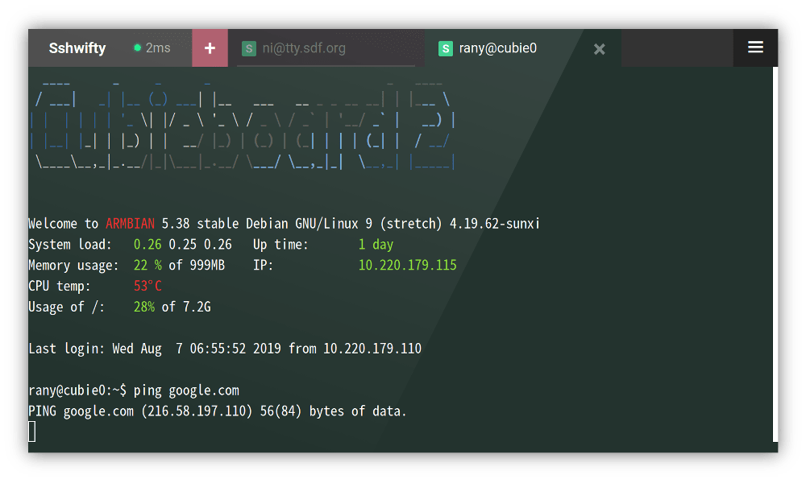

# Sshwifty Web SSH & Telnet Client

**Sshwifty is a SSH and Telnet connector made for the Web.** It can be deployed
on your computer or server to provide SSH and Telnet access interface for any
compatible (standard) web browser.




## Install

### Binary

Compiled binaries can be found at the [release] section of the page.

Please be advised that those binaries is generated by an automatic proccess,
the author of this project will NOT verify them. You have to try it at your owk
risk.

[release]: https://github.com/nirui/sshwifty/releases

### Docker Image

If [Docker] is installed on your machine, you may use our prebuild Docker Image
by executing following command:

```
$ docker run --detach \
  --restart always \
  --publish 8182:8182 \
  --name sshwifty \
  niruix/sshwifty:latest
```

When TLS is desired and you don't want to setup Docker Volumes, you can use
`SSHWIFTY_DOCKER_TLSCERT` and `SSHWIFTY_DOCKER_TLSCERTKEY` environment variables
to import credential files to the container and automatically apply them:

```
$ openssl req \
  -newkey rsa:4096 -nodes -keyout domain.key -x509 -days 90 -out domain.crt
$ docker run --detach \
  --restart always \
  --publish 8182:8182 \
  --env SSHWIFTY_DOCKER_TLSCERT="$(cat domain.crt)" \
  --env SSHWIFTY_DOCKER_TLSCERTKEY="$(cat domain.key)" \
  --name sshwifty \
  niruix/sshwifty:latest
```

The `domain.crt` and `domain.key` must be valid TLS certificate and key file
located on the same machine which the `docker run` command will be executed
upon.

[docker]: https://www.docker.com

### Compile from source code (Recommanded if you're a developer)

Following tools is required in order to build the software from source code:

- `git` to download the source code
- `node` and `npm` to build front-end application
- `go` to build back-end application

To start the build process, execute:

```
$ git clone https://github.com/nirui/sshwifty
$ cd sshwifty
$ npm install
$ npm run build
```

When done, you can found the newly generated `sshwifty` binary inside current
working directory.

Notice: `Dockerfile` contains the entire build procedure of this software.
Please refer to it when you encountered any compile/build related issue.

### Deploy on the cloud

To deploy this project onto the cloud, Google App Engine or Heroku for example,
you need to first download the source code, then generate it locally before
deploying it.

`npm run generate` command will generate all static files and automatically
call `go generate ./...` to bind those static files directly into program source
code. And you need those generated source code to get the software to function.

Trying to deploy ungenerated code directly to cloud will lead to failure, as
required source code is missing.

Also keep in mind, if the cloud deployment process is `git` based, you may have
to modify `.gitignore` file in order to allow all required files to be uploaded.

## Configure

Sshwifty can be configured through either file or environment variables. By
default, the configuration loader will try to load file from default paths
first, when failed, environment variables will be used.

You can also specify your own configuration file by setting up `SSHWIFTY_CONFIG`
environment variable before start the software. For example:

```
$ SSHWIFTY_CONFIG=./sshwifty.conf.json ./sshwifty
```

This way, Sshwifty will try to load the configuration from file
`./sshwifty.conf.json`, and never reach for other environment variables.

### Configuration file

Here is all the options of a configuration file:

```
{
  // HTTP Host. Keep it empty to accept request from all hosts, otherwise, only
  // specified host is allowed to access
  "HostName": "localhost",

  // Web interface access password. Set to empty to allow public access
  "SharedKey": "WEB_ACCESS_PASSWORD",

  // Remote dial timeout. This limits how long of time the backend can spend
  // to connect to a remote host. The max timeout will be determined by
  // server configuration (ReadTimeout).
  // (In Seconds)
  "DialTimeout": 10,

  // Socks5 proxy. When set, Sshwifty backend will try to connect remote through
  // the given proxy
  "Socks5": "localhost:1080",

  // Username of the Socks5 server. Please set when needed
  "Socks5User": "",

  // Password of the Socks5 server. Please set when needed
  "Socks5Password": "",

  // Sshwifty HTTP server, you can set multiple ones to serve on different
  // ports
  "Servers": [
    {
      // Which local network interface this server will be listening
      "ListenInterface": "0.0.0.0",

      // Which local network port this server will be listening
      "ListenPort": 8182,

      // Timeout of initial request. HTTP handshake must be finished within
      // this time
      // (In Seconds)
      "InitialTimeout": 3,

      // How long do the connection can stay in idle before the backend server
      // disconnects the client
      // (In Seconds)
      "ReadTimeout": 60,

      // How long the server will wait until the client connection is ready to
      // recieve new data. If this timeout is exceed, the connection will be
      // closed.
      // (In Seconds)
      "WriteTimeout": 60,

      // The interval between internal echo requests
      // (In Seconds)
      "HeartbeatTimeout": 20,

      // Forced delay between each request
      // (In Milliseconds)
      "ReadDelay": 10,

      // Forced delay between each write
      // (In Milliseconds)
      "WriteDelay": 10,

      // Path to TLS certificate file. Set empty to use HTTP
      "TLSCertificateFile": "",

      // Path to TLS certificate key file. Set empty to use HTTP
      "TLSCertificateKeyFile": ""
    },
    {
      "ListenInterface": "0.0.0.0",
      "ListenPort": 8182,
      "InitialTimeout": 3,
      .....
    }
  ],

  // Remote Presets, the operater can define few presets for user so the user
  // won't have to manually fill-in all the form fields
  //
  // Presets will be displayed in the "Known remotes" tab on the Connector
  // window
  //
  // Notice: You can use the same JSON value for `SSHWIFTY_PRESETS` if you are
  //         configuring your Sshwifty through enviroment variables.
  //
  // Warning: Presets Data will be sent to user client WITHOUT any protection.
  //          DO NOT add any secret information into Preset.
  //
  "Presets": [
    {
      // Title of the preset
      "Title": "SDF.org Unix Shell",

      // Preset Types, i.e. Telnet, and SSH
      "Type": "SSH",

      // Target address and port
      "Host": "sdf.org:22",

      // Form fields and values, you have to manually validate the correctness
      // of the field value
      //
      // Defining a Meta field will prevent user from changing it on their
      // Connector Wizard. If you want to allow users to use their own settings,
      // leave the field unsetted
      //
      // Values in Meta are scheme enabled, and supports following scheme
      // prefixes:
      // - "literal://": Text literal (Default)
      //                 Example: literal://Data value
      //                          (The final value will be "Data value")
      //                 Example: literal://file:///tmp/afile
      //                          (The final value will be "file:///tmp/afile")
      // - "file://": Load Meta value from given file.
      //              Example: file:///home/user/.ssh/private_key
      //                       (The file path is /home/user/.ssh/private_key)
      // - "environment://": Load Meta value from an Environment Variable.
      //                    Example: environment://PRIVATE_KEY_DATA
      //                    (The name of the target environment variable is
      //                    PRIVATE_KEY_DATA)
      //
      // All data in Meta is loaded during start up, and will not be updated
      // even the source already been modified.
      //
      "Meta": {
        // Data for predefined User field
        "User": "pre-defined-username",

        // Data for predefined Encoding field. Valid data is those displayed on
        // the page
        "Encoding": "pre-defined-encoding",

        // Data for predefined Password field
        "Password": "pre-defined-password",

        // Data for predefined Private Key field, should contains the content
        // of a Key file
        "Private Key": "file:///home/user/.ssh/private_key",

        // Data for predefined Authentication field. Valid values is what
        // displayed on the page (Password, Private Key, None)
        "Authentication": "Password",

        // Data for server public key fingerprint. You can acquire the value of
        // the fingerprint by manually connect to a new SSH host with Sshwifty,
        // the fingerprint will be displayed on the Fingerprint comformation
        // page.
        "Fingerprint": "SHA256:bgO...."
      }
    },
    {
      "Title": "Endpoint Telnet",
      "Type": "Telnet",
      "Host": "endpoint.vaguly.com:23",
      "Meta": {
        // Data for predefined Encoding field. Valid data is those displayed on
        // the page
        "Encoding": "utf-8"
        ....
      }
    },
    ....
  ],

  // Allow the Preset Remotes only, and refuse to connect to any other remote
  // host
  //
  // NOTICE: You can only configure OnlyAllowPresetRemotes through a config
  //         file. This option is not supported when you are configuring with
  //         environment variables
  OnlyAllowPresetRemotes: false
}
```

`sshwifty.conf.example.json` is an example of a valid configuration file.

### Environment variables

Valid environment variables are:

```
SSHWIFTY_HOSTNAME
SSHWIFTY_SHAREDKEY
SSHWIFTY_DIALTIMEOUT
SSHWIFTY_SOCKS5
SSHWIFTY_SOCKS5_USER
SSHWIFTY_SOCKS5_PASSWORD
SSHWIFTY_LISTENPORT
SSHWIFTY_INITIALTIMEOUT
SSHWIFTY_READTIMEOUT
SSHWIFTY_WRITETIMEOUT
SSHWIFTY_HEARTBEATTIMEOUT
SSHWIFTY_READDELAY
SSHWIFTY_WRITEELAY
SSHWIFTY_LISTENINTERFACE
SSHWIFTY_TLSCERTIFICATEFILE
SSHWIFTY_TLSCERTIFICATEKEYFILE
SSHWIFTY_PRESETS
SSHWIFTY_ONLYALLOWPRESETREMOTES
```

The option they represented is corresponded to their counterparts in the
configuration file.

Notice: When you're using environment variables to configure Sshwifty, only one
Sshwifty HTTP server is then allowed. There is no way to setup mulitple servers
under this method of configuration. If you need to serve on multiple ports, use
configuration file instead.

Be aware: An invalid value inside following environment variables will cause
the value to be sliently reset to default during configuration parsing phase
without warning:

```
SSHWIFTY_DIALTIMEOUT
SSHWIFTY_INITIALTIMEOUT
SSHWIFTY_READTIMEOUT
SSHWIFTY_WRITETIMEOUT
SSHWIFTY_HEARTBEATTIMEOUT
SSHWIFTY_READDELAY
SSHWIFTY_WRITEELAY
```

## FAQ

### Why the software says "The time difference is beyond operational limit"?

This usually happens when the clock on the client and/or the server is unsynced
beyond tolerance.

Please make sure the clock time on both the client and the server are correct by
resync them with a NTP server, and then reload the page. The problem should be
gone afterwards.

### Why I got error "TypeError: Cannot read property 'importKey' of undefined"

It's usually because your web browser does not support WebCrypt API, or the
support has been disabled.

If you're using Google Chrome, please connect Sshwifty with HTTPS. Chrome will
disable WebCrypt and many other APIs when the connection is not safe.

### Can I serve Sshwifty under a subpath such as `https://my.domain/ssh`?

The short story is NO. Sshwifty was designed based on an assumption that it will
run as the only service under a given hostname, allowing web browsers to better
enforce their data isolation rules. This is very important because Sshwifty
saves user data locally.

However, if you really want to put Sshwifty into a subpath, you can do so by
taking advantage of the fact that Sshwifty backend interface and assets are
always located under an URL prefix `/sshwifty`. You can thus redirect or proxy
those requests to their new location.

Keep in mind, doing so is really hacky, and it's not recommended by the author
thus no support will be provided if you decide to go with that.

### Why I can't add my own key combinations to the Console tool bar?

The pre-defined key combinations are there mainly to make mobile operation
possible as well as to resolve some hotkey conflicts. However, if efficiency is
your first goal, please consider to use a software/on screen keyboard which is
specially designed for terminal.

And if that's not enough, connect a physical keyboard through Bluetooth or OTA
could be a better alternative. This way you can type as if you're using a
computer console.

## License

Code of this project is licensed under AGPL, see [LICENSE.md] for detail.

Third-party components used by this project are licensed under their respective
licenses. See [DEPENDENCIES.md] to learn more about dependencies used by this
project and read their copyright statements.

[LICENSE.md]: LICENSE.md
[DEPENDENCIES.md]: DEPENDENCIES.md

## Contribute

This is a hobbyist project, meaning I don't have too many time to put into it.
Sorry.

Upon release (Which is then you're able to read this file), this project will
enter _maintaining_ state, which includes doing bug fix and security updates.
_Adding new features however, is not a part of the state_.

Please do not send pull request. If you need new feature, fork it, add it by
yourself, and maintain it like one of your own project.

(Notice: Typo, grammar error or invalid use of language in the source code and
document is categorized as bug, please report them if you found any. Thank you!)

Appreciate your help!

Enjoy!
